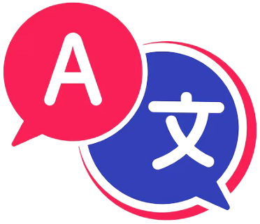

# 🌍 Language Translator  
A **web-based language translation application** built using **HTML, CSS, and JavaScript**, designed to provide **real-time translation** across multiple languages with an intuitive and user-friendly interface.  



## 📌 Table of Contents  

- [Features](#features-section)  
- [Installation](#installation-section)  
- [Usage](#usage-section)  
- [Project Structure](#project-structure-section)  
- [Technologies Used](#technologies-used-section)  
- [Contributing](#contributing-section)  
- [Future Enhancements](#future-enhancements-section)  
- [License](#license-section)  
- [Contact Us](#contact-us-section) 

---

<a id="features-section"></a>
## 🚀 Features  
✅ **Real-time translation** between multiple languages  
✅ **Simple & interactive UI** for ease of use  
✅ **Copy & paste functionality** for quick text handling  
✅ **Text-to-speech feature** for pronunciation assistance  
✅ **Cross-device & cross-browser compatibility**  
✅ **Lightweight and fast** with no backend dependencies  

---

<a id="installation-section"></a>
## 💻 Installation  
1. Clone this repository:  
   ```bash
   git clone https://github.com/your-username/Language-Translator.git
   ```

2. Navigate to the project directory:
    ```bash
    cd Language-Translator
    ```

3. Open index.html in your web browser to start using the translator.

<a id="usage-section"></a>
## 📖 Usage
- Select the source and target languages from the dropdown menus.
- Enter text in the input box.
- Click the "Translate" button to get the translated text instantly.
- Use the copy button to copy the text or the speaker icon for text-to-speech output.

<a id="project-structure-section"></a>
## 🏗️ Project Structure
```plaintext
    📂 Language-Translator  
    ├── 📂 assets/                # Icons, images, and resources  
    ├── 📂 js/                    # JavaScript files  
    │   ├── script.js             # Main script handling translation  
    │   ├── countries.js          # List of supported languages  
    ├── 📂 css/                   # Stylesheets  
    │   ├── style.css             # Main styles for the project  
    │   ├── translate.css         # Styles specific to the translation page  
    ├── index.html                # Homepage  
    ├── translate.html            # Translation page  
    ├── README.md                 # Project documentation  
    ├── LICENSE                   # License information  
```

<a id="technologies-used-section"></a>
## 🛠️ Technologies Used
- HTML5 – Structure and layout
- CSS3 – Styling and responsiveness
- JavaScript (ES6) – Functionality and interactivity
- Google Translate API / MyMemory API – Translation services

<a id="contributing-section"></a>
## 🤝 Contributing
Want to contribute? Follow these steps:
- Fork this repository.
- Create a new branch for your feature:
    ```bash
    git checkout -b feature-name
    ```

- Commit your changes and push them:
    ```bash
    git commit -m "Add new feature"
    git push origin feature-name
    ```
- Submit a Pull Request for review.

<a id="future-enhancements-section"></a>
## 🔮 Future Enhancements
- Offline translation support using local AI models
- Speech-to-text feature for voice input translation
- Dark mode support for better UI accessibility
- Integration with more APIs for improved accuracy

<a id="license-section"></a>
## 📜 License

This project is licensed under the MIT License. You are free to use, modify, and distribute this project with proper attribution.

<a id="contact-us-section"></a>
## 📧 Contact Us
For any queries or feedback, reach out:
- 📩 E-Mail: krishnapatilcontact@gmail.com
- 🌐 GitHub: KrishnaPatil-19

🌍 Breaking language barriers, one translation at a time! 🚀